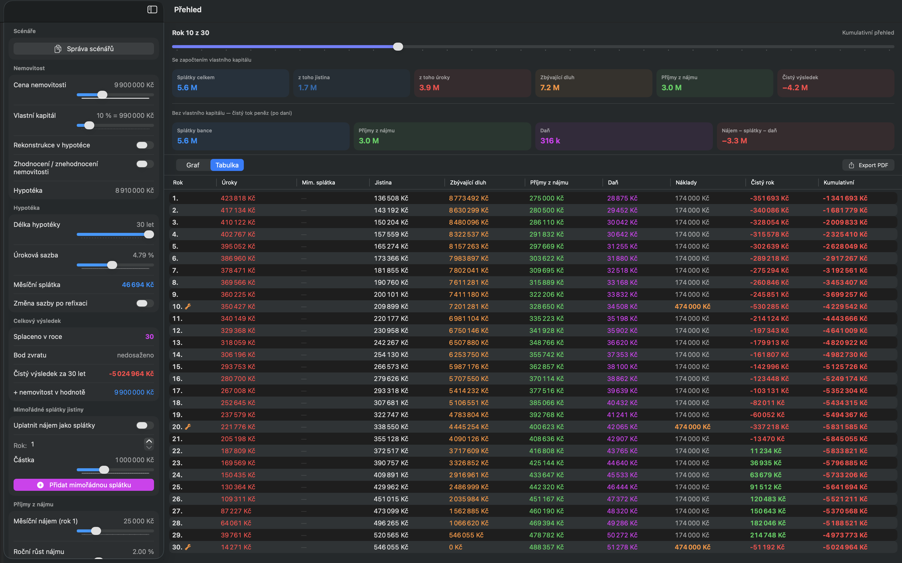
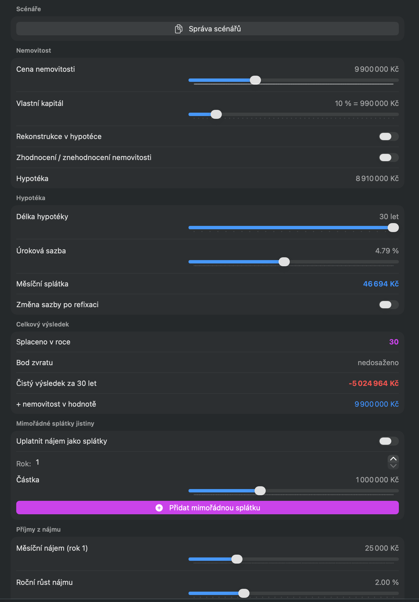
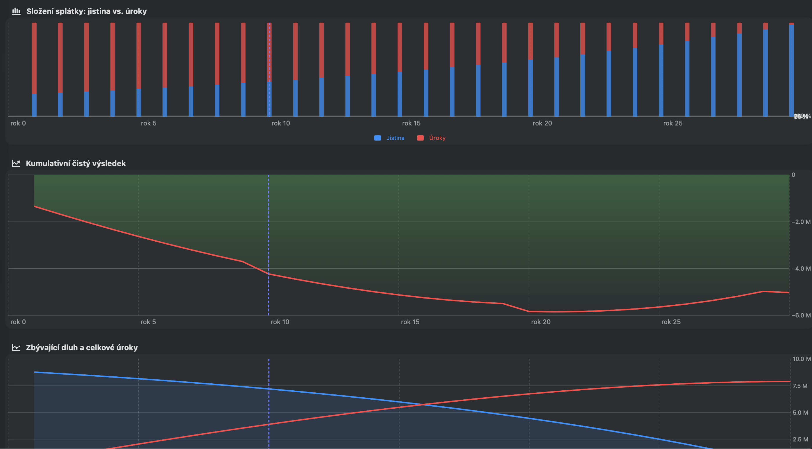
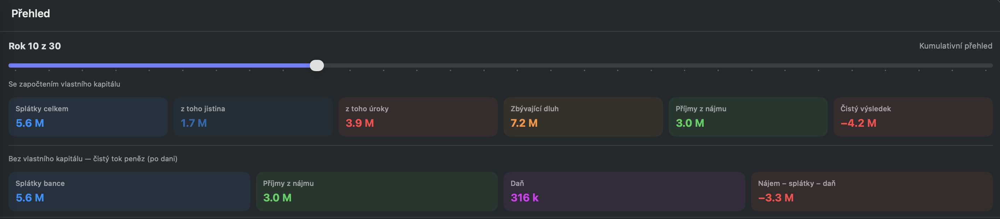
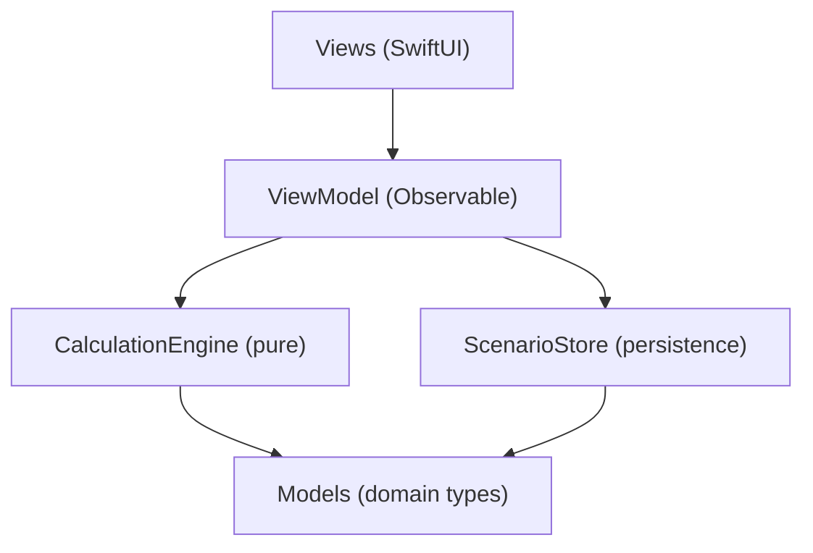

# Mortgage Calculator (Hypoteční kalkulačka)

An iPad investment simulator for property financed by a mortgage. Not a simple payment calculator — a complete financial model that answers: *"Is this property worth buying as a rental investment?"*

[](https://github.com/pavel-jurka/hypokalkulacka/actions)

Unlike standard mortgage calculators, this app models:
- **Rental cash flow** with vacancy, growth, and operating costs
- **Equity accumulation** — principal repayment builds net worth, not just cost
- **Czech rental taxation** — flat-rate 30% expense or actual costs (§ 9 ZDP)
- **Extra payments** — manual or automatic from rental income
- **Property appreciation/depreciation** (−5% to +10%/year)
- **Inflation-adjusted returns** and alternative investment comparison
- **Scenario comparison** — save, load, and compare A vs B side by side

## Screenshots

**Full app — inputs, snapshot cards, amortization table:**



| Input panel | Charts | Snapshot cards |
|---|---|---|
|  |  |  |

## Why iPad?

Investment scenario analysis benefits from screen real estate:
- **Side-by-side layout** — inputs on the left, results on the right, instant feedback
- **Large charts** — 4 detailed financial charts without scrolling
- **Full table visibility** — 10-column amortization schedule at a glance
- **Touch-friendly sliders** — drag to explore "what if" scenarios naturally

## Quick Start

```bash
git clone https://github.com/pavel-jurka/hypokalkulacka.git
cd hypokalkulacka
open MortgageCalculator.xcodeproj
```

Requirements: iPadOS 17+ / macOS 14+, Xcode 15+, no external dependencies.

## Features

### Financial Model

| Category | Parameters |
|---|---|
| **Property** | Price (1M–30M CZK), own capital (5–50%), reconstruction (0–2M), appreciation (−5% to +10%) |
| **Mortgage** | Duration (5–30y), interest rate (0.5–10%), refixation after N years |
| **Rental income** | Monthly rent (10k–80k), annual growth (0–8%), vacancy (0–4 months/year) |
| **Operating costs** | Insurance, SVJ/maintenance fund, property management fee (% of rent) |
| **Repairs** | Annual maintenance + periodic major repairs every N years |
| **Tax** | Czech income tax — flat-rate 30% or actual costs with full deductions (§ 9 ZDP) |
| **Extra payments** | Manual one-off + automatic rent-as-payments (reactive, grows with rent) |
| **Investment view** | Appreciation, alternative return comparison, inflation discount |
| **Scenarios** | Save named scenarios, load, compare side by side |

### Interactive UI

- **4 charts** — amortization breakdown, cumulative net result, debt vs. interest, annual result
- **Snapshot slider** — drag to any year, see 3 rows of cumulative cards
- **PDF export** — parameters, result cards, charts, full year-by-year table
- **Toggle-based** — every feature is optional, flip switches to compare scenarios instantly

### Calculation Model

Annuity: `M = P × r × (1+r)^n / ((1+r)^n − 1)`

Net result: `−own_capital + Σ(rent − interest − repairs − operating − tax − extra)`

Principal repayment is NOT subtracted — it converts cash into property equity.

Total investment: `cumulative_net + property_value − remaining_debt`

### Performance

~360 monthly iterations per recalculation. Instant on any modern device — no caching needed.

## Architecture



All financial calculations are **deterministic pure functions** — no SwiftUI dependency, no side effects, no shared state. The engine accepts `MortgageInputs`, returns `[YearData]`. Fully testable in isolation.

<details>
<summary>Detailed file structure</summary>

```
MortgageCalculator/
├── .github/workflows/
│   └── build-and-test.yml              — CI: build + test on push/PR
├── MortgageCalculator/
│   ├── MortgageCalculatorApp.swift     — entry point
│   ├── FinancialTypes.swift            — CZK, Percent, Years, Months + formatter
│   ├── Models.swift                    — TaxMode, ExtraPayment, YearData, MortgageInputs
│   ├── CalculationEngine.swift         — pure calculation functions (~220 lines)
│   ├── MortgageViewModel.swift         — Observable ViewModel (~205 lines)
│   ├── ScenarioStore.swift             — save/load scenarios (UserDefaults)
│   ├── ContentView.swift               — root view (21 lines)
│   └── Views/                          — 7 focused view files
├── MortgageCalculatorTests/            — 45+ unit tests (XCTest)
└── CLAUDE.md                           — AI assistant context
```

</details>

<details>
<summary>Key design decisions</summary>

| Decision | Why |
|---|---|
| `@Observable` (not `ObservableObject`) | Eliminates `@Published` boilerplate, cleaner reactivity |
| Separated domain layer | Engine is pure, testable independently. `MortgageInputs` decouples UI from computation |
| Computed `schedule` | Reactive to every input change. 360 iterations = instant |
| XCTest (not Swift Testing) | Universal Xcode compatibility for CI |
| PDF via `ImageRenderer` | No UIKit dependency |
| Explicit `save()` in ScenarioStore | `didSet` is unreliable with `@Observable` macro |

</details>

## Testing

45+ unit tests (XCTest):

- Annuity correctness (standard, zero-rate, known reference values)
- Amortization invariants (balance, monotonicity, principal + interest = payment)
- Tax logic (both Czech modes, full deductions)
- Refixation, extra payments, auto-payment reactivity
- Operating costs, appreciation, snapshot values
- Edge cases and financial precision
- Direct CalculationEngine tests (independent of ViewModel)

```bash
xcodebuild test \
  -scheme MortgageCalculator \
  -destination 'platform=macOS' \
  -only-testing:MortgageCalculatorTests
```

## CI/CD

GitHub Actions on every push/PR to `main`: build + unit tests (macOS 15, Xcode 16).

## Roadmap

- [x] Screenshots in README
- [ ] iCloud scenario sync
- [ ] Monte Carlo stress testing (rate hikes, rent drops, vacancy spikes)
- [ ] Monthly cash flow granularity
- [ ] Portfolio mode (multiple properties)
- [ ] Refinancing comparison
- [ ] Localization (EN)
- [ ] macOS native layout

## What the App Does Not Model

- Mortgage insurance (pojištění schopnosti splácet)
- Vacancy patterns beyond average months/year
- Depreciation allowance as tax deduction
- Currency other than CZK

## License

Source available for reference and learning. Not licensed for redistribution.
